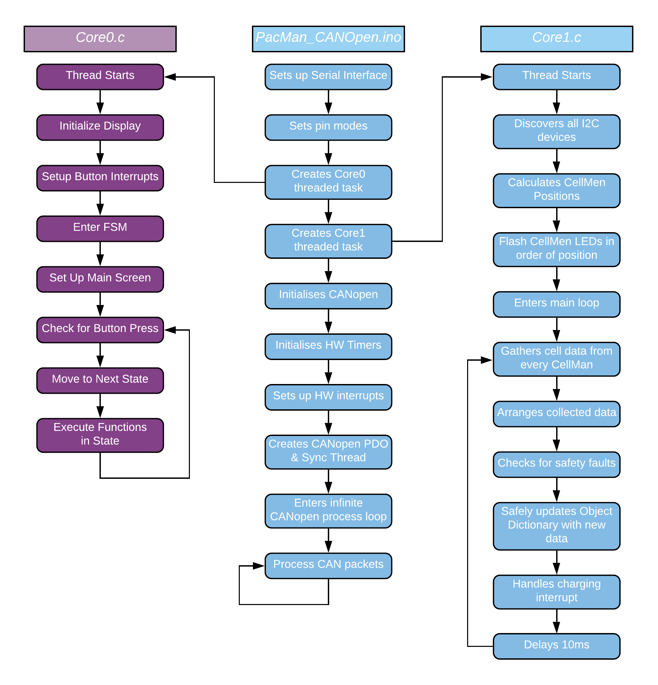

# PacMan Firmware

This repository contains the firmware code for Lafayette College's 2019/2020 PacMan Board. It is written in C/C++ with extensive use of Arduino & [ESP-IDF](https://github.com/espressif/esp-idf) specific functions and libraries. We also have rather extensively modified the [CANopenNode](https://github.com/CANopenNode/CANopenNode) library to work on the ESP32 and the [ESP-IDF's CAN driver](https://docs.espressif.com/projects/esp-idf/en/latest/esp32/api-reference/peripherals/can.html). Branches are used in this repository and it is recommended to check other branches for the bleeding edge.

## Description

This project provides the firmware for the ESP32 processor used on the [PacMan board](https://github.com/Lafayette-FSAE/PacMan). It provides essential functions for the board, including but not limited to, CAN Bus communication via the CANopen protocol, Pack e-ink Display operation, I2C-based CellMen communication, and other various important operational and safety checks.

## Getting Started

1. Install the [Arduino IDE](https://www.arduino.cc/en/main/software). Tested on version 1.8.10
2. Add ESP32 board to the Arduino IDE by adding this Additional Board Manager URL: https://dl.espressif.com/dl/package_esp32_index.json. A tutorial is located [here](https://randomnerdtutorials.com/installing-the-esp32-board-in-arduino-ide-windows-instructions/)
3. Select the ESP32 Dev Module in the boards list - Though most of the common boards here listed here will be compatible
4. Clone this Github repository. A tutorial for git can be found [here](https://github.github.com/training-kit/downloads/github-git-cheat-sheet/). We recommend also using [Github Desktop](https://desktop.github.com/) or IDE with Github support like [Atom](https://atom.io/) or [Visual Studio Code](https://code.visualstudio.com/download); the latter of which can also be used to easily programme and upload to the board if you are not a fan of the Arduino IDE.
5. Open up the file: *PacMan_CANOpen.ino* located in the *PacMan_CANOpen* directory in the repository. This should open in the Arduino IDE if installed correctly
6. Connect the ESP32 Dev Board to the computer via the microUSB port
7. Select the proper serial port from the "Tools" drop down and set the baud rate to 115200 (isn't it funny how all the baud rates are multiples of 60 ;) )
8. Click on the compile and upload button (The right-facing arrow on the upper-left of the IDE)
9. Open the Serial Monitor by clicking on the Magnifying glass in the top right corner or going to "Tools" -> "Serial Monitor" after the computer has compiled and uploaded the code

## Using the PacMan

Insert details about the display and front panel buttons here. Reach out to me about how to put images if you want here Simone!

## Connecting up the PacMan

Detailed instructions for this are located in the TSV User-Manual (TODO: Put a link to it here on the website) since this ties heavily with the overall assembly of the pack.

## Process Diagram



## Notes & Further Documentation

- You can expand the documentation here by using the Doxygen documentation included in our code. A tutorial can be found [here](http://www.doxygen.nl/manual/starting.html). You should have Doxygen installed on your system beforehand. This can easily be done on Debian linux based systems like Raspbian on the RaspberryPi by entering the following commands into the Terminal:

  - ```bash
    sudo apt-get update -y
    ```

  - ```bash
    sudo apt-get install -y doxygen
    ```

* Setting the `#define DEBUG` in our code to `true` will allow more serial output to be displayed to the user for debugging purposes to see the state of the PacMan more clearly
* A tutorial on how to setup a RaspberryPi from scratch can be found [here](https://projects.raspberrypi.org/en/projects/raspberry-pi-setting-up). Note that to get internet you will have to register the device (if it has fallen out of registration from our accounts) on Lafayette's network like you do on your laptop or desktop. IP addresses can often change on Lafayette's network so it is recommended to setup the Pi on a monitor and keyboard and mouse and then [setup the RaspberryPi to email it's IP upon boot-up](https://elinux.org/RPi_Email_IP_On_Boot_Debian) (Note: add a [delay](https://realpython.com/python-sleep/) into this code to allow the RaspberryPi to connect to WiFi first or it could easily fail).
  * A pre-built image including the repository and the Arduino IDE can be found here, including the drivers needed for the CAN hat. You can use this to easily compile and upload the code onto the PacMan. This image will not have the IP script.

## Useful Documents

- [PacMan Board Repository with Schematic and Board Layout](https://github.com/Lafayette-FSAE/PacMan)
  - Requires the [FSAE KiCAD libraries](https://github.com/Lafayette-FSAE/KiCad-Libraries) for proper viewing.
- [Usable ESP32 Pins](https://randomnerdtutorials.com/esp32-pinout-reference-gpios/)
- [Brief overview of CANopen](https://www.csselectronics.com/screen/page/canopen-tutorial-simple-intro/language/en)
- [Brief overview of I2C](https://learn.sparkfun.com/tutorials/i2c/all)

## Authors - Feel free to email us questions about our parts!

- [Clement Hathaway](mailto:cwbh10@gmail.com) - Communication, Safety, and Documentation
- [Simone Khalifa](mailto:khalifas@lafayette.edu) - Display, Interface, and Documentation
- [Dwayne Whittaker](mailto:whittakd@lafayette.edu) - Communication and Safety

## Other Useful Links

- [A tutorial for writing and using Libraries (similar to classes) in Arduino](https://www.arduino.cc/en/Hacking/libraryTutorial)
- [Custom building in the Atom IDE](https://atom.io/packages/build)
- [Arduino Command Line Interface (CLI) to use with the custom building](https://github.com/arduino/arduino-cli)
- [Tips on using Git and Github within Atom](https://flight-manual.atom.io/using-atom/sections/version-control-in-atom/)
- [Our CAN interface hat for the RaspberryPi](https://copperhilltech.com/pican-2-can-bus-interface-for-raspberry-pi/)
  - [A tutorial for setup on Raspbian (debian)](https://copperhilltech.com/pican2-controller-area-network-can-interface-for-raspberry-pi/) 
